# Detection image de chiffre manuscrit

Executé le init.py au clonage du repo

Le dataset <https://www.kaggle.com/datasets/scolianni/mnistasjpg/discussion>
archive.zip > trainingSet > trainingSet

<table>
    <thead>
        <tr>
            <th colspan="5">Dataset</th>
        </tr>
        <tr>
            <th>Nom</th>
            <th>Nombre d'images</th>
            <th>Graphique de repartition</th>
        </tr>
    </thead>
    <tbody>
        <tr>
            <td>Base</td>
            <td>42 000</td>
            <td>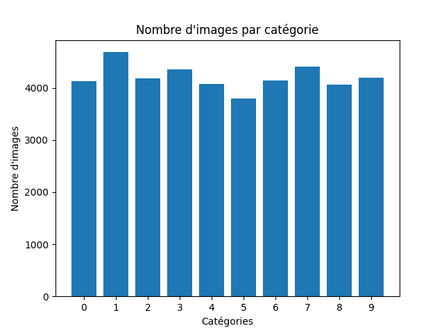</th>
        </tr>
        <tr>
            <td>Decalle</td>
            <td>210 000</td>
            <td></th>
        </tr>
        <tr>
            <td>Decalle PLUS</td>
            <td>546 000</td>
            <td></th>
        </tr>
        <tr>
            <td>Decalle BANGER</td>
            <td>1 050 000</td>
            <td>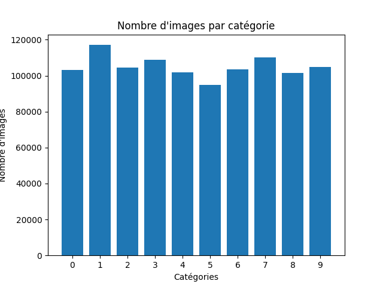</th>
        </tr>
        <tr>
            <td>Decalle BANGER 2</td>
            <td>3 150 000</td>
            <td>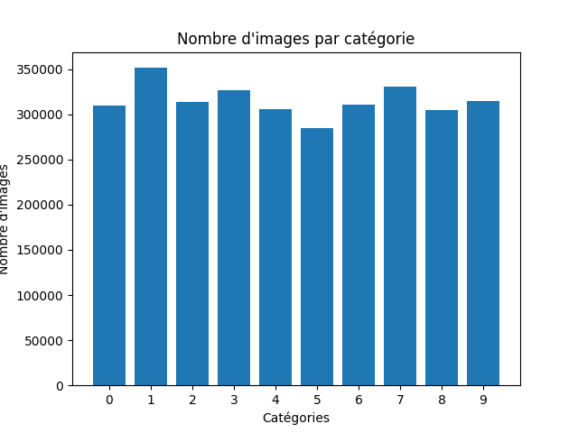</th>
        </tr>
    </tbody>
</table>

<table>
    <thead>
        <tr>
            <th colspan="5">Statistique</th>
        </tr>
        <tr>
            <th>Source</th>
            <th>Accuracy 20 epochs</th>
            <th>Image 20 epochs</th>
            <th>Accuracy 30 epochs</th>
            <th>Image 30 epochs</th>
        </tr>
    </thead>
    <tbody>
        <tr>
            <td>Set de base: 42 000 images</td>
            <td>99.22 %</td>
            <td>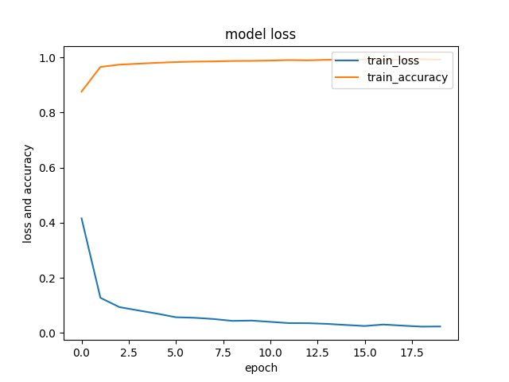</th>
            <td>99.09 %</td>
            <td>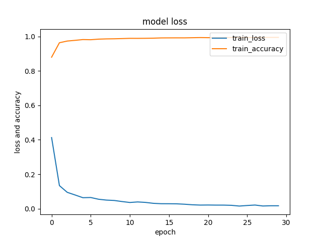</th>
        </tr>
        <tr>
            <td>Image decalle: 210 000 images</td>
            <td>99.77 %</td>
            <td>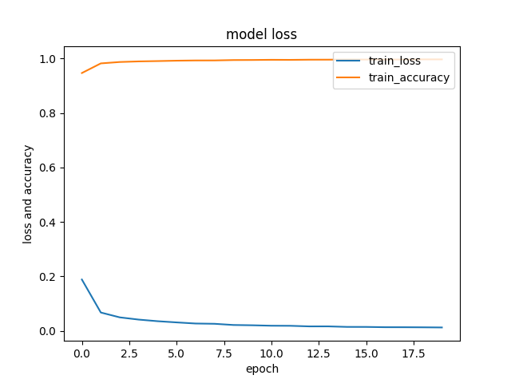</th>
            <td>99.85 %</td>
            <td>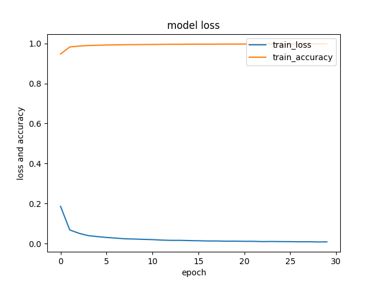</th>
        </tr>
        <tr>
            <td>Image decalle PLUS: 546 000 images</td>
            <td>99.89 %</td>
            <td>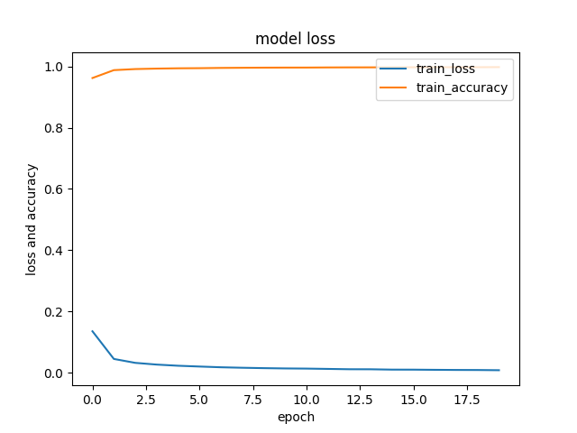</th>
            <td>99.94 %</td>
            <td></th>
        </tr>
        <tr>
            <td>Image decalle BANGER: 1 050 000 images</td>
            <td>99.95 %</td>
            <td>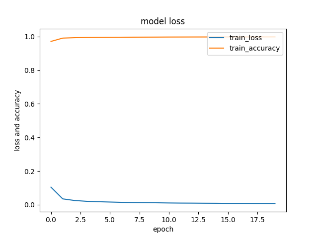</th>
            <td>99.97 %</td>
            <td>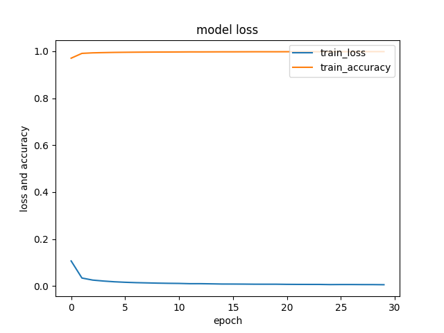</th>
        </tr>
        <tr>
            <td>Image decalle BANGER 2: 3 150 000 images</td>
            <td>99.93 %</td>
            <td>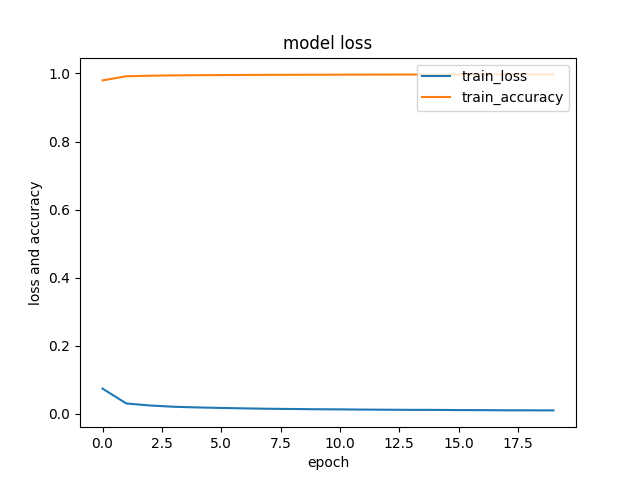</th>
            <td>99.94 %</td>
            <td>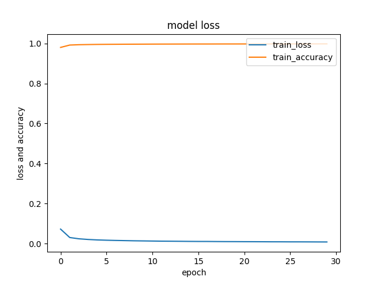</th>
        </tr>
    </tbody>
</table>
